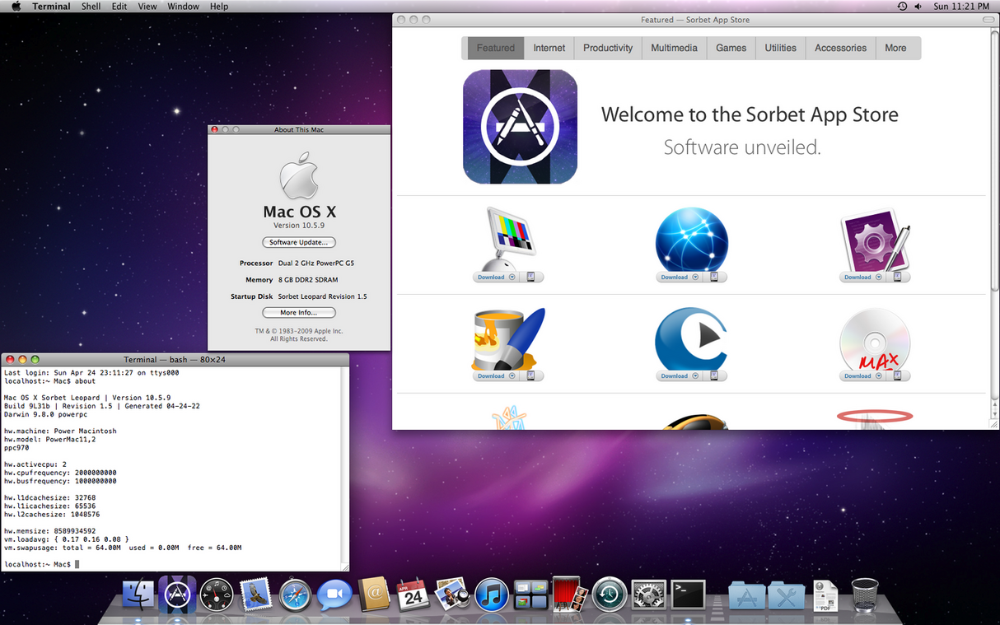

Sorbet Leopard 10.5.9

There are quite a few Powermac Enthusiast around the world, like I am. They are
using the Powermac G5 for day-to-day work and I think this is pretty cool,
even when I think we need to go green as fast as possible in the reason of
power consumption, I will give it a try. My G5 doesnt need more than 250 Watts
even with the Cinema HD 23" Display in use.

magine if Mac OS X 10.6 Snow Leopard was released for the PowerPC architecture. Aging machines would have received a much-needed boost in performance, software updates would have carried on for a little bit further, and instrumental features would have been newly claimed -- resulting in pre-existing hardware being kept in service for much longer.

While Apple opted not to continue the development of Snow Leopard for PowerPC-based Macs, that did not stop dedicated communities from filling this void (and then some) over a decade later. Enter Sorbet Leopard, a fresh new release of Mac OS X designed exclusively for the venerable Power Macintosh, fifteen years after the final model was sold.

Built off of the rock-solid Mac OS X 10.5 Leopard base system, Mac OS X 10.5.9 Sorbet Leopard offers a significant jump in speed and security over its predecessor by utilizing advanced methods of performance optimization, system streamlining, and brand new features, all together rivaling most of the UX improvements seen in Snow Leopard on Intel machines.

Thanks to the over 70 new changes present in Mac OS X 10.5.9, here's what to expect once installed ...

- Faster startup times, application launch times, and network performance
- Smoother, more fluid, and more consistent UI animations
- A brand new app store tailored for only the best apps on Mac OS X 10.5.x
- Built-in tools to create RAM disks, run routine maintenance, configure hidden preferences, toggle background services, and more
- Full compatibility with the Apple Wireless Keyboard and Magic Mouse
- Full compatibility with Unicode 13.1 emoji characters
- Updated desktop pictures, user pictures, screen savers, fonts, and Apple dictionaries, alongside apps such as Dashboard 1.7, Exposé 1.1, Front Row 1.1, Spaces 1.1, Time Machine 1.1, Java Preferences 13.9.8, and System Profiler 10.6.0, all from the final release of Mac OS X 10.6 Snow Leopard
- Comprehensive system themes inline with OS X 10.8 Mountain Lion, macOS 10.13 High Sierra, and iOS 4 to 12, featuring authentic desktop pictures, user pictures, screen savers, and UI assets unique to each choice
- Updated security certificates inline with macOS 10.13 High Sierra
- Updated applications including Safari 11 with new security updates and performance improvements, QuickTime 7.7 Pro, Bash 4.3.30, and ntpd 4.2.8
- Integrated optimizations such as reduced disk activity, reduced CPU / RAM / disk usage, PowerPC-optimized binaries, and universal ad blocking

### Ressources:
- [Get Sorbet Leopard on Macintoshgarden](https://macintoshgarden.org/apps/sorbet-leopard)

Tags: powermacg5, leopard, sorbet-leopard, macosx
