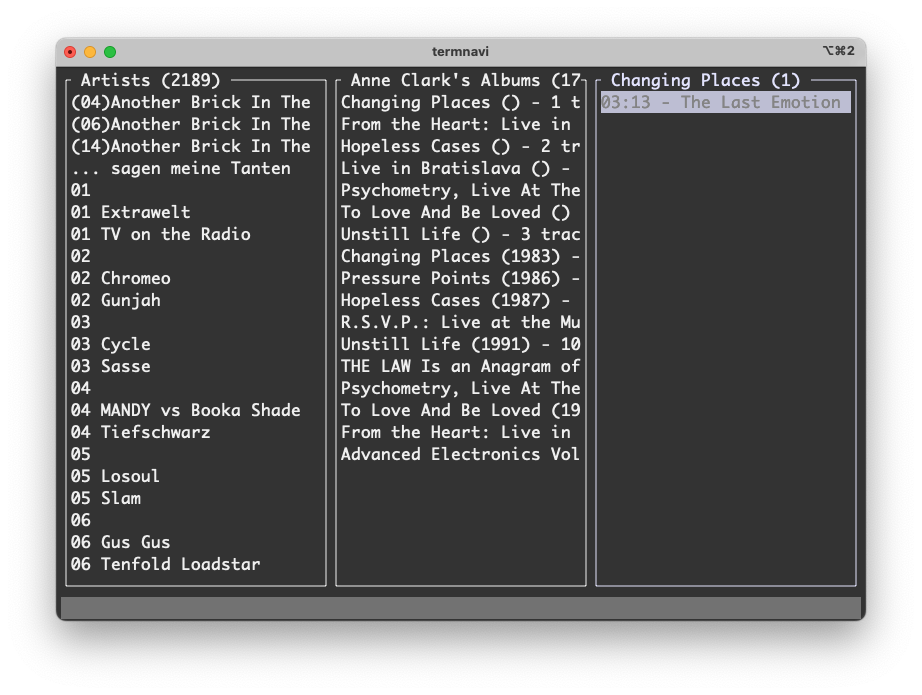

TermNavi Terminal Navidrome Client ppc64

So the other day I tried to connect to my **Navidrome** MP3 Streaming Server, 
I call it "Spotify at Home", via Webinterface to listen to some music, but
there were no way to do this. The Webbrowsers available are too old. Sad.

So I decided to programm a really small *Navidrome Terminal Client* called
TermNavi (yes I know... need better name) to listen to my MP3. And what shall 
I say? The first implementation is ready. I tested and successfully compiled
on aarch64 (my MacMini M4) and the legendary Powermac G5 with ARCH Linux or
Debian Sid ppc64.

So this it is:

* MVP for playback
* Rust for pgramming
* Ratatui für the Terminal UI (TUI)
* a Powermac G5 with PPC Linux

Really happy, it is my first rust project. 

### known bugs

* State handling is missing
* UI Rendering for more selections
* scroll logic is worst

And as a now cool hacker guy, I pushed everything in my github repo. But don't
expect too much, I am a worst programmer, I often do not understand what is 
going on and I have everything in one file, the main.rs :-)

### Ressources
* [TermNavi Github Repo](https://github.com/thafaker/termnavi/tree/main)

Tags: ppc64, navidrome, rust, terminal, powermacg5, linux
